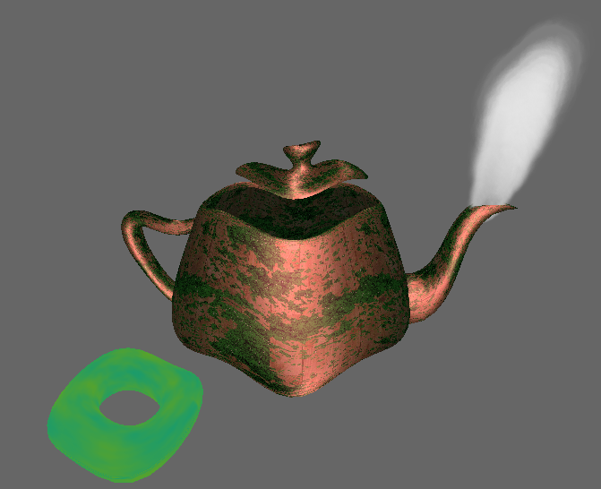

# COMP3015C2

###Optimised Developer Tool

## Versions

- ##### Visual studio
	- Microsoft Visual Studio Community 2019
	- Version 16.7.5
- ##### Windows
	- Windows 10
	- Version 1909

### How it works
Works using opengl to create a 3D model with custom shaders using the blinn-phong lighting model, with multiple light sources. Uses vertex animations to create waves animation on two object. Uses another shader to emitt particles looking like steam from the spout of the tea pot.

### How the code fit together
scenebasic_uniform.cpp is essentially the main file (other than the shader files) that puts together all the extra libaries and additional files.  It contains functions that sets up the main scene, renders the 3D model and sets all the value and buffers for the shaders.

 ### Link
- [Youtube video](https://youtu.be/xn1_9s4RiK8)
- [Github page](https://github.com/wmastersPlym/COMP3015C2)